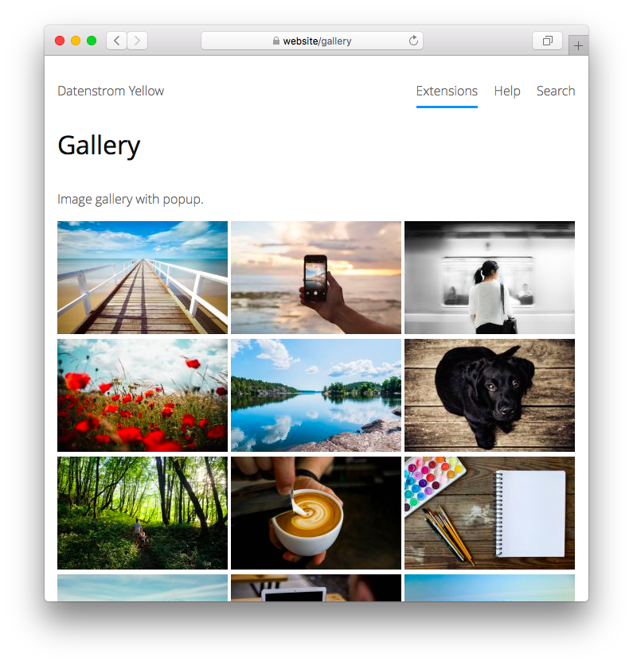

<a href="README-de.md">Deutsch</a> &nbsp; <a href="README.md">English</a> &nbsp; <a href="README-sv.md">Svenska</a>

# Gallery 0.8.19

Bildgalleri med popup.

## Hur man installerar ett tillägg

[Ladda ner ZIP-filen](https://github.com/annaesvensson/yellow-gallery/archive/refs/heads/main.zip) och kopiera den till din `system/extensions` mapp. [Läs mer om tillägg](https://github.com/annaesvensson/yellow-update/tree/main/README-sv.md).

## Hur man lägger till ett bildgalleri

Skapa en `[gallery]` förkortning.

Följande argument är tillgängliga, alla utom det första argumentet är valfria:

`Pattern` = filnamn som reguljära uttryck  
`Sorting` = gallerisortering, t.ex. `name`, `modified`, `size`  
`Style` = galleristil, t.ex. `zoom`, `simple`  
`Size` = bildstorlek, pixel eller procent  

Bildformaten GIF, JPG, PNG och SVG stöds. Alla mediefiler finns i `media` mappen.
Mappen `media/images` är platsen för att lagra dina bilder. Mappen `media/thumbnails` innehåller miniatyrbilder. Du kan också skapa ytterligare mappar och organisera filer som du vill.

## Hur man visar bildtexter

Bildtexter kan konfigureras i språkinställningarna. Öppna filen `system/extensions/yellow-language.ini` och lägg till en ny rad för varje bild. En rad består av filnamn och beskrivning. Bildtexten visas när du klickar på en bild eller använder en skärmläsare.

## Exempel

Lägga till ett bildgalleri, olika sorteringar:

    [gallery photo.*jpg name]
    [gallery photo.*jpg modified]
    [gallery photo.*jpg size]

Lägga till ett bildgalleri, olika storlekar:

    [gallery photo.*jpg name zoom 25%]
    [gallery photo.*jpg name zoom 50%]
    [gallery photo.*jpg name zoom 100%]

Lägga till ett bildgalleri, rektangulära miniatyrbilder:

    [gallery photo.*jpg name zoom 64]
    [gallery photo.*jpg name zoom 150]
    [gallery photo.*jpg name zoom 300]

Lägga till ett bildgalleri från en undermapp, rektangulära miniatyrbilder:

    [gallery photo-album/ name zoom 64]
    [gallery photo-album/ name zoom 150]
    [gallery photo-album/ name zoom 300]

Konfigurera bildtexter i språkinställningarna:

    Language: sv
    media/images/photo.jpg: Detta är en exempelbild
    media/images/photo-2387365-fika-time.jpg: Fika är en viktig del av vardagen i Sverige. Bild: Taylor Franz
    media/images/photo-2493837-lake-and-forest.jpg: Sjö och skog på sommaren. Bild: Anatoliy Gromov
    media/images/photo-album/screenshot-2020-01.png: En liten webbplats av Adam Engel från Sverige.

## Inställningar

Följande inställningar kan konfigureras i filen `system/extensions/yellow-system.ini`:

`GallerySorting` = gallerisortering, t.ex. `name`, `modified`, `size`  
`GalleryStyle` = galleristil, t.ex. `zoom`, `simple`  

## Tack

Detta tillägg innehåller [PhotoSwipe 4.1.2](https://github.com/dimsemenov/photoswipe) av Dmitry Semenov. Tack för ett bra jobb.

## Utvecklare

Anna Svensson. [Få hjälp](https://datenstrom.se/sv/yellow/help/).
